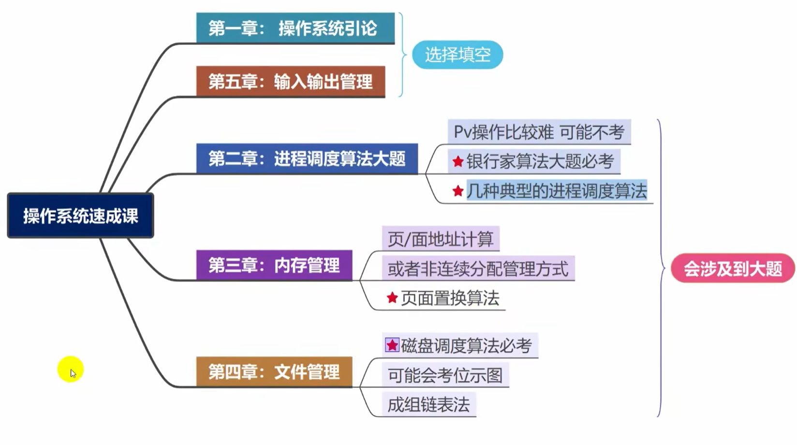

# 操作系统

操作系统学习笔记

## 大纲

## 第一章：操作系统引论

### 操作系统介绍

#### 基本特征(选择或填空)

- 并发：是指两个或多个活动在同一给定的时间间隔中进行
- 共享：是指计算机系统中的资源被多个进程所共用
- 异步：进程以不可预知的速度向前推进
- 虚拟：把一个物理上的实体变为若干个逻辑上的对应物

> **最**基本特征：**并发**和**共享**(两者互为存在条件)

#### 主要功能

- 处理及管理：主要功能包括进程控制、进程同步、进程通信、死锁处理、处理机调度等
- 存储器管理：主要包括内存分配、地址映射、内存保护与共享和内存扩充等功能
- 文件管理：包括文件存储空间的管理、目录管理及文件读写管理和保护等
- 设备管理：主要包括缓冲管理、设备分配、设备处理和虚拟设备等功能

#### 发展(选择或填空)

1. 手工操作阶段(此阶段无操作系统)

   > 缺点：人机速度矛盾

2. 批处理阶段(操作系统开始出现)

   - 单道批处理阶段
   - 多道批处理阶段(操作系统正式诞生)。目的：提高系统资源利用率

     > 优点：多道程序并发执行，资源利用率高

     > 缺点：不提供人机交互能力(缺少交互性)

3. 分时操作系统(不可以插队，有了人机交互)

   > 优点：提供人机交互(交互性)

   > 缺点：不能优先处理紧急事务(无法抢票)

4. 实时操作系统(可以插队)

   - 硬实时操作系统：**必须**在被控制对象规定时间内完成(火箭发射)
   - 软实时操作系统：可以松一些(打车、订票)

   > 优点：能优先处理紧急任务

> 从可靠性看实时操作系统更强，从交互性看分时操作系统更强

### 不得不知的概念

#### 两种指令

- 特权指令：不允许用户程序使用(只允许操作系统使用)。如 IO 指令、置中断指令
- 非特权指令：普通运算指令

#### 两种程序

- 内核程序：系统的管理者，可执行一切指令、运行在核心态
- 应用程序：普通用户程序只能执行非特权指令，运行在用户态

#### 处理及状态

- 用户态(目态)：CPU 只能执行非特权指令
- 核心态(又称管态、内核态)：可以执行所有指令
- 用户态到核心态：通过中断(是硬件完成的)
- 核心态到用户态：特权指令 psw 的标志位 0 用户态 1 核心态

> 常考谁在用户态执行，谁在核心态执行

#### 原语

1. 处于操作系统的最低层，是最接近硬件的部分
2. 这些程序的运行具有原子性，其操作只能一气呵成
3. 这些程序的运行时间都较短，而且调用频繁

#### 中断和异常

- 内中断(异常，信号来自内部)

  - 自愿中断
    - 指令中断
  - 强迫中断
    - 硬件中断
    - 软件中断

- 外中断(中断，信号来着外部)

  - 外设请求
  - 人工干预

#### 系统调用

系统给程序员(应用程序)提供的唯一接口，可获得 OS 的服务。在用户态发生，核心态处理

> 系统给程序员(应用程序)提供的唯一接口是：<u>系统调用</u>

#### 体系结构

- 大内核
- 微内核
