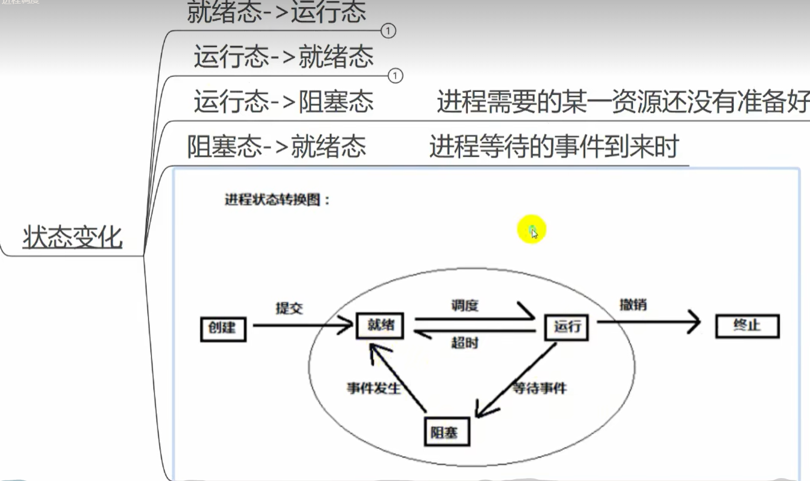

# 操作系统

操作系统学习笔记

[TOC]

## 大纲

## 第一章：操作系统引论

### 1. 操作系统介绍

#### 1.1 基本特征(选择或填空)

- 并发：是指两个或多个活动在同一给定的时间间隔中进行
- 共享：是指计算机系统中的资源被多个进程所共用
- 异步：进程以不可预知的速度向前推进
- 虚拟：把一个物理上的实体变为若干个逻辑上的对应物

> **最**基本特征：**并发**和**共享**(两者互为存在条件)

#### 1.2 主要功能

- 处理及管理：主要功能包括进程控制、进程同步、进程通信、死锁处理、处理机调度等
- 存储器管理：主要包括内存分配、地址映射、内存保护与共享和内存扩充等功能
- 文件管理：包括文件存储空间的管理、目录管理及文件读写管理和保护等
- 设备管理：主要包括缓冲管理、设备分配、设备处理和虚拟设备等功能

#### 1.3 发展(选择或填空)

1. 手工操作阶段(此阶段无操作系统)

   > 缺点：人机速度矛盾

2. 批处理阶段(操作系统开始出现)

   - 单道批处理阶段
   - 多道批处理阶段(操作系统正式诞生)。目的：提高系统资源利用率

     > 优点：多道程序并发执行，资源利用率高

     > 缺点：不提供人机交互能力(缺少交互性)

3. 分时操作系统(不可以插队，有了人机交互)

   > 优点：提供人机交互(交互性)

   > 缺点：不能优先处理紧急事务(无法抢票)

4. 实时操作系统(可以插队)

   - 硬实时操作系统：**必须**在被控制对象规定时间内完成(火箭发射)
   - 软实时操作系统：可以松一些(打车、订票)

   > 优点：能优先处理紧急任务

> 从可靠性看实时操作系统更强，从交互性看分时操作系统更强

### 2. 不得不知的概念

#### 2.1 两种指令

- 特权指令：不允许用户程序使用(只允许操作系统使用)。如 IO 指令、置中断指令
- 非特权指令：普通运算指令

#### 2.2 两种程序

- 内核程序：系统的管理者，可执行一切指令、运行在核心态
- 应用程序：普通用户程序只能执行非特权指令，运行在用户态

#### 2.3 处理及状态

- 用户态(目态)：CPU 只能执行非特权指令
- 核心态(又称管态、内核态)：可以执行所有指令
- 用户态到核心态：通过中断(是硬件完成的)
- 核心态到用户态：特权指令 psw 的标志位 0 用户态 1 核心态

> 常考谁在用户态执行，谁在核心态执行

#### 2.4 原语

1. 处于操作系统的最低层，是最接近硬件的部分
2. 这些程序的运行具有原子性，其操作只能一气呵成
3. 这些程序的运行时间都较短，而且调用频繁

#### 2.5 中断和异常

- 内中断(异常，信号来自内部)

  - 自愿中断
    - 指令中断
  - 强迫中断
    - 硬件中断
    - 软件中断

- 外中断(中断，信号来着外部)

  - 外设请求
  - 人工干预

#### 2.6 系统调用

系统给程序员(应用程序)提供的唯一接口，可获得 OS 的服务。在用户态发生，核心态处理

> 系统给程序员(应用程序)提供的唯一接口是：<u>系统调用</u>

#### 2.7 体系结构

- 大内核
- 微内核

## 第二章：进程调度

### 1. 进程管理

#### 1.1 引入进程的目的

为了更好地描述和控制程序并发执行，实现操作系统的并发性和共享性(进程是动态的，程序是静态的)

#### 1.2 定义

是计算机中的程序关于某数据集合上的一次运行活动，是系统进行资源分配和调度的基本单位

#### 1.3 组成

- PCB

  > 保存进程运行期间相关的数据，是进程存在的**唯一标志**

- 程序段

  > 能被进程调度到 CPU 的代码

- 数据段

#### 1.4 进程的状态

- 状态种类

  - 运行态

        进程正在占用CPU

  - 就绪态

        进程已处于准备运行的状态，即进程获得了除处理机外的一切所需资源，一旦得到处理机即可运行

  - 阻塞态
  - 创建状态

        进程正在被创建

  - 结束状态

        进程正在从系统消失

- 状态变化

  

#### 1.5 线程

- 引入目的

      为了更好的使用多道程序并发执行，提高资源利用率和系统吞吐量

- 特点

      是程序执行的最小单位，基本不拥有任何系统资源(调度的基本单位)

### 2. ⭐ 处理机调度

#### 2.1 概念

是对处理机进行分配，即从就绪队列中按照定的算法(公平、高效)选择一个进程并将处理机分配给它运行，以实现进程并发地执行 。

#### 2.2 分类

- 高级调度(作业调度)(次数少)

- 中级调度(内存对换)(次数中等)

- 初级调度(进程调度)(次数多)

#### 2.3 调度方式

- 剥夺式

- 非剥夺式

#### 2.4 调度准则

- CUP 利用率

- 系统吞吐量

- 周转时间

- 等待时间

- 响应时间

#### 2.5 算法

- 先来先服务

- 短作业优先

- 优先级调度算法

- 高响应比优先调度算法

  > 高响应比 = (运行时间 + 等待时间) / 等待时间
  >
  > 所以高相应比一定大于 1

- 时间片轮转

  > 一定是剥夺式

- 多级反馈队列调度算法

### 3. 进程同步

#### 3.1 引入原因

协调进程之间的相互制约关系

#### 3.2 制约关系

- 同步

  亦称直接制约关系，是指为完成某种任务而建立的两个或多个进程，这些进程因为需要在某些位置上协调它们的工作次序而等待、传递信息所产生的制约关系。

- 互斥

  也称间接制约关系。当一个进程进入临界区使用临界资源时，另一个进程必须等待，当占用临界资源的进程退出临界区后，另进程才允许去访问此临界资源。

#### 3.3 临界资源

一次仅允许一个进程使用的资源（打印机，共享缓冲区，共享变量，公用队列）

#### 3.4 临界区

在每个进程中访问临界资源的那段程序

#### 3.5 临界区互斥

- 原则(⭐)

  - 空闲让进：如果有若干进程要求进入空闲的临界区，一次仅允许一个进程进入 。

  - 忙则等待：任何时候，处于临界区内的进程不可多于一个。如已有进程进入自己的临界区，则其它所有试图进入临界区的进程必须等待。

  - 有限等待：进入临界区的进程要在有限时间内退出，以便其它进程能及时进入自己的临界区。

  - 让权等待：如果进程不能进入自己的临界区，则应让出 CPU，避免进程出现"忙等"现象。

- 基本方法

  - 信号量(一道大题)
    > 利用 PV 操作实现互斥

### 4. 死锁

#### 4.1 产生的原因

非剥夺资源的竞争和进程的不恰当推进顺序(与饥饿的区别)

#### 4.2 定义

多个进程因竞争资源而造成的一种僵局，如果没有外力，这些进程将无法推进

#### 4.3 解决方法

##### 4.3.1 预防死锁

- 破坏互斥条件
- 破坏不剥夺条件
- 破坏请求和保持条件
- 破坏循环等待条件

##### 4.3.2 避免死锁

- 安装状态
- ⭐ 银行家算法

##### 4.3.3 检测死锁:利用死锁定理

##### 4.3.4 解除死锁

- 资源剥夺法
- 撤销进程法
- 进程回退法
